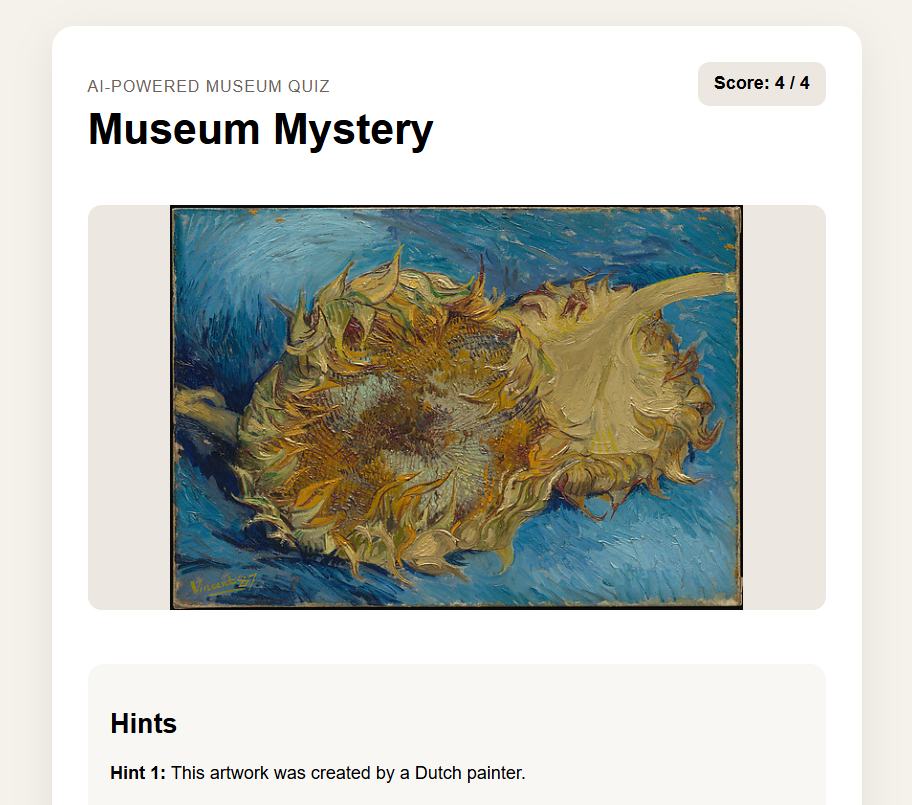

# Museum Mystery

**Museum Mystery** is an interactive AI-powered museum guessing game.
Players view a real artwork image, reveal progressive hints, submit their guess, and then receive a grounded explanation with a source link.

This project was built for the **Agents League Hackathon – Creative Apps** track.

## Tagline

**Discover art through AI-powered museum mysteries.**

---

## Project Overview

Museum Mystery turns public museum artwork data into a playful educational quiz experience.

Instead of presenting artwork information directly, the app invites users to guess the artwork through a set of clues. After answering, users receive:

* The correct artwork title
* A short factual explanation
* The artist and date
* A source link to the museum record
* A running score

The goal is to make art discovery more interactive, accessible, and enjoyable.

---

## Features

* Interactive artwork guessing game
* Real artwork images from The Metropolitan Museum of Art public collection
* Progressive hint reveal system
* Answer checking
* Score tracking
* Grounded explanations
* Source links for artwork records
* React frontend
* Flask backend
* Azure AI Search knowledge source
* Microsoft Foundry IQ Knowledge Base integration

---

## Microsoft IQ Integration

This project integrates **Microsoft Foundry IQ** through a Knowledge Base connected to an **Azure AI Search index**.

The Azure AI Search index stores grounded artwork metadata, including:

* Artwork title
* Artist
* Date
* Department
* Description
* Source URL

The Foundry IQ Knowledge Base is connected to this search index and acts as the grounding layer for factual artwork information.

The Flask backend also queries the same Azure AI Search index by artwork ID to retrieve aligned explanations and source URLs for the quiz experience.

High-level flow:

```text
React Frontend
      ↓
Flask Backend
      ↓
The Met Collection API for artwork images
      ↓
Azure AI Search index for grounded artwork metadata
      ↓
Foundry IQ Knowledge Base connected to the same knowledge source
```

This helps ensure that artwork explanations are based on structured, source-backed data rather than unsupported generation.

---

## Architecture

```text
museum-mystery/
├── backend/
│   ├── app.py
│   └── requirements.txt
├── frontend/
│   ├── src/
│   │   ├── App.jsx
│   │   ├── App.css
│   │   └── index.css
│   └── package.json
├── knowledge-base/
├── artworks-documents.json
├── search-index.json
├── .env.example
├── .gitignore
└── README.md
```

---

## How It Works

1. The React frontend requests a new puzzle from the Flask backend.
2. The backend randomly selects one artwork ID.
3. The backend retrieves the artwork image from The Metropolitan Museum of Art public collection API.
4. The backend retrieves artwork metadata and explanation from Azure AI Search.
5. The frontend displays the image, hints, answer input, explanation, score, and source link.

---

## Demo Flow

A typical demo:

1. Open the Museum Mystery web app.
2. View a mystery artwork image.
3. Reveal one or more hints.
4. Type a guess.
5. Submit the answer.
6. See whether the answer is correct.
7. Read the grounded explanation.
8. Open the source link to verify the artwork record.
9. Click **Next Mystery** to continue.

---

## Screenshot



---

## Tech Stack

### Frontend

* React
* Vite
* JavaScript
* CSS

### Backend

* Python
* Flask
* Flask-CORS
* Requests
* Python-dotenv

### Cloud / AI

* Microsoft Foundry
* Foundry IQ Knowledge Base
* Azure AI Search
* The Metropolitan Museum of Art Collection API

---

## Local Setup

### 1. Clone the repository

```bash
git clone https://github.com/Arcshic/museum-mystery.git
cd museum-mystery
```

### 2. Backend setup

```bash
cd backend
python -m venv .venv
```

Activate the virtual environment on Windows PowerShell:

```powershell
.\.venv\Scripts\Activate.ps1
```

Install dependencies:

```bash
python -m pip install -r requirements.txt
```

### 3. Environment variables

Create a `.env` file in the project root:

```env
AZURE_SEARCH_SERVICE_NAME=
AZURE_SEARCH_INDEX_NAME=
AZURE_SEARCH_API_KEY=
AZURE_SEARCH_API_VERSION=2025-09-01
```

Do not commit `.env` to GitHub.

A safe example file is provided as:

```text
.env.example
```

### 4. Run the backend

From the `backend` folder:

```bash
python app.py
```

The backend runs at:

```text
http://127.0.0.1:5000
```

### 5. Frontend setup

Open a second terminal:

```bash
cd frontend
npm install
npm run dev
```

The frontend runs at:

```text
http://localhost:5173
```

---

## Azure AI Search Setup

The search index is defined in:

```text
search-index.json
```

The artwork documents are defined in:

```text
artworks-documents.json
```

The index includes a semantic configuration named:

```text
default
```

The uploaded sample artwork documents include:

* Sunflowers — Vincent van Gogh
* Young Woman with a Water Pitcher — Johannes Vermeer
* Cypresses — Vincent van Gogh

---

## GitHub Copilot Usage

GitHub Copilot was used during development to support the creative coding process, including:

* Drafting the initial Flask API structure
* Creating the React component layout
* Building the hint reveal and answer submission flow
* Refactoring frontend state management
* Debugging local development issues
* Improving README structure and project documentation

Copilot helped accelerate development while the final implementation decisions, architecture, testing, and integration steps were reviewed manually.

---

## Security and Privacy

This project uses only public or synthetic demo data.

The repository does not include:

* API keys
* Passwords
* Tokens
* Customer data
* Personal information
* Confidential company information
* Private documents

Sensitive configuration should be stored only in a local `.env` file.

The `.gitignore` file excludes environment variables, virtual environments, dependency folders, certificates, and generated files.

---

## Limitations

This is a hackathon MVP. Current limitations include:

* A small artwork dataset
* No user accounts
* No database persistence
* No leaderboard
* No production deployment
* Limited answer matching
* Limited accessibility testing

Future improvements could include:

* Larger artwork collections
* Difficulty levels
* More flexible answer matching
* Timed challenge mode
* Accessibility improvements
* Deeper Foundry IQ retrieval workflows
* Deployed public demo

---

## Why This Project Fits Creative Apps

Museum Mystery combines education, art, and play into a lightweight creative experience.

It is not just a standard chatbot. It presents knowledge as an interactive guessing game, using grounded artwork metadata to make museum discovery more engaging.

The project demonstrates how AI-assisted development and grounded knowledge retrieval can be used to create playful, source-backed learning experiences.

---

## Credits

Artwork data and images are based on public records from The Metropolitan Museum of Art Collection API.

Built for the Agents League Hackathon Creative Apps track.
